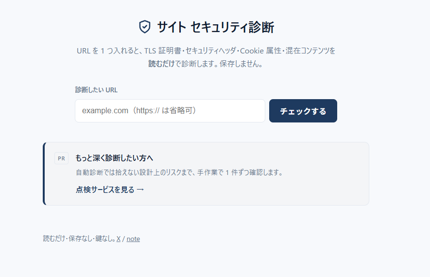

# site-security-check（v0）



公開サイトのセキュリティ衛生を URL 1 つで診断する。**読むだけ・保存なし・鍵なし**。
他人のサイトを取得して「ヘッダ / 証明書 / Cookie / 混在コンテンツ」を点検する lead magnet。

**公開版**：<https://sleepycat12341013.github.io/site-security-check/>（画面は GitHub Pages で即表示。診断 API は Render 稼働で、初回の診断のみ起動に数十秒かかることがある）

## 使い方

```
node server.mjs        # http://localhost:3000 が開く
```

URL を入れて「診断」。結果はスコア + 項目ごとの ✅ / ⚠️ と「何が・なぜ危険か」。

## テスト

```
node --test            # check.mjs の純粋ロジックを検証
```

## 構成

| ファイル | 役割 |
|---|---|
| `server.mjs` | 薄い HTTP サーバ。URL を取得 → 生データ収集（fetch / TLS）→ 判定は check に委譲 |
| `check.mjs` | 純粋な診断ロジック（ネットワーク無し・テスト可能） |
| `index.html` | 入力フォーム + 結果表示（バニラ JS） |
| `style.css` | 最小スタイル |

## 診断項目

- **TLS 証明書**：有効性・期限（14 日以内は警告）
- **セキュリティヘッダ**：CSP / HSTS / X-Content-Type-Options / X-Frame-Options / Referrer-Policy
- **Cookie 属性**：HttpOnly / Secure / SameSite
- **混在コンテンツ**：HTTPS ページ内の `http://` リソース

## 安全設計

- 取得対象を**保存しない**・APIキー等の**秘密を持たない**＝被害半径ゼロ。
- **SSRF 防止**：内部 / プライベート / ループバックアドレスは診断を拒否（v1 で公開しても踏み台にされない）。

## ロードマップ

- **v0**（今ここ）：コア + 画面。ステートレス。
- **v1**：アカウント + 保存 + 定期監視（cron）+ 通知。
- **v2**：課金（Stripe / PAY.JP のホスト型で決済を offload）。

---

思想・構成：cmalu ractu / 実装補助：Claude（Anthropic）
