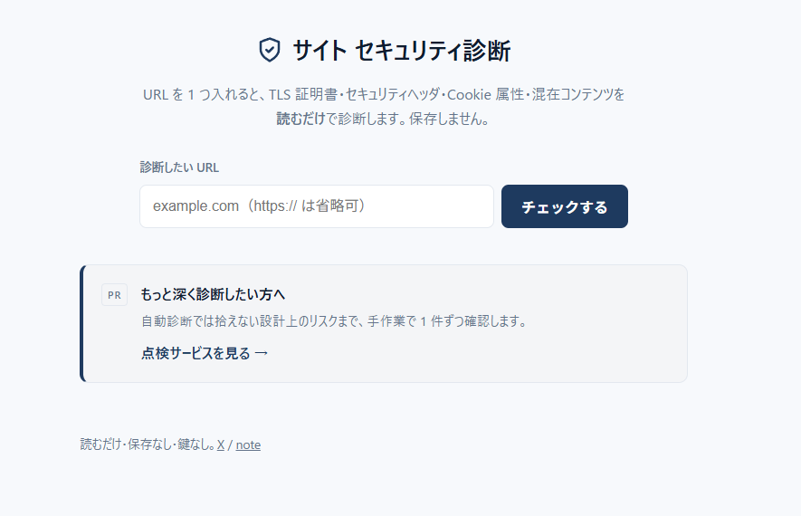

# site-security-check

Check the security hygiene of any public website from a single URL.
**Read-only. Nothing stored. No credentials held.**

<p align="center">
  
</p>

**Live:** <https://sleepycat12341013.github.io/site-security-check/>
The page is served from GitHub Pages; the checking API runs on Render, so the
first request of the day can take up to a minute while the instance wakes.

---

## What it checks

| | |
|---|---|
| **TLS certificate** | Validity and expiry — warns at 14 days remaining |
| **Security headers** | CSP, HSTS, X-Content-Type-Options, X-Frame-Options, Referrer-Policy |
| **Cookie attributes** | HttpOnly, Secure, SameSite |
| **Mixed content** | `http://` resources loaded by an `https://` page |

Results are a score plus a per-item ✅ / ⚠️, each with a short explanation of
what is wrong and why it matters.

---

## The part that took the most care: not reporting false safety

For a security checker, a false ✅ is worse than a missed finding — it tells
someone they are protected when they are not. Most of the test suite exists to
prevent exactly that:

- **`HSTS: max-age=0` is a warning, not a pass.** The header is present, but a
  zero max-age disables the policy.
- **A cookie whose *value* contains `secure` is not treated as having the
  attribute.** Substring matching on a `Set-Cookie` line gets this wrong.
- **`SameSite=None` counts as insufficient**, not as "SameSite is configured".
- **An unreadable certificate expiry only passes when `authorized === true`.**
  Ambiguity warns rather than passes.
- **`<a href="http://…">` is a link, not mixed content** — only resources that
  the page actually loads are flagged. `<link href>` *is* flagged, regardless of
  attribute order.
- **Multiple cookies count as one scored item**, so a site with many cookies
  cannot have its score dominated by that single category.

```
node --test     # 18 tests, all passing
```

The checking logic in `check.mjs` performs no network I/O, which is what makes
it testable in isolation.

---

## Safe by construction

- **Nothing fetched is ever stored**, and the service holds no API keys or
  secrets — so there is nothing to leak.
- **SSRF protection**: internal, private and loopback addresses are refused, so
  a public deployment cannot be used to probe networks it should not reach.

---

## Layout

| File | Role |
|---|---|
| `server.mjs` | Thin HTTP server: fetches the URL, collects raw data (fetch / TLS), delegates all judgement to `check.mjs` |
| `check.mjs` | Pure diagnostic logic — no network, fully testable |
| `check.test.mjs` | 18 tests, mostly regression guards against false passes |
| `index.html` | Input form and results (vanilla JS) |
| `style.css` | Minimal styling |

## Running locally

```bash
node server.mjs     # http://localhost:3000
```

---

_Ideas, concepts, proofreading and editing: cmalu ractu_
_Text generation: Claude (Anthropic)_
